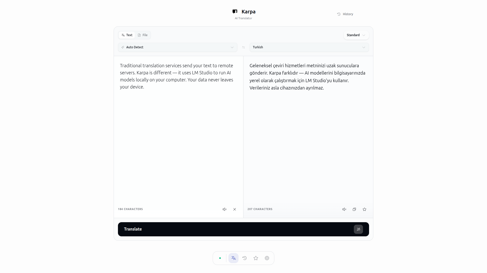

<p align="center">
  
</p>

<h1 align="center">Karpa</h1>

<p align="center">
  <strong>Privacy-first AI translation that runs entirely on your machine</strong>
</p>

<p align="center">
  <a href="#features">Features</a> •
  <a href="#quick-start">Quick Start</a> •
  <a href="#installation">Installation</a> •
  <a href="#usage">Usage</a>
</p>

<p align="center">
  
</p>

Karpa is a privacy-first AI translator that runs entirely on your machine.
Your data never leaves your device — no cloud, no tracking, no compromises.

Supports LM Studio, Ollama, OpenAI, Anthropic, Google Gemini, and OpenRouter.

---

## Features

| Feature | Description |
|---|---|
| **Complete Privacy** | All translations happen locally using LM Studio. No data is ever sent to external servers. |
| **Multi-Language Support** | Translate between 12+ languages including English, Turkish, Spanish, French, German, Italian, Portuguese, Russian, Japanese, Chinese, Korean, and Arabic. |
| **Text & File Translation** | Translate plain text or upload files (`.txt`, `.md`, `.json`, `.csv`, `.srt`, and more). |
| **Translation Tones** | Choose from Standard, Formal, Casual, or Technical tones to match your context. |
| **History & Favorites** | Automatically save your translation history and star your favorite translations. |
| **Beautiful UI** | Modern, responsive design with dark mode support and smooth animations. |
| **Text-to-Speech** | Listen to translations with built-in TTS support for multiple languages. |

---

## Quick Start

### Prerequisites

1. **[LM Studio](https://lmstudio.ai/)** — Download and install
2. **Translation Model** — Download a model (recommended: `HY-MT1.5-7B`)
3. **Start Local Server** — Run LM Studio's local server on port `1234`

### Run Karpa

```bash
# Clone
git clone https://github.com/sudoeren/karpa.git && cd karpa

# Install
npm install

# Start
npm run dev
```

Open **http://localhost:7250** and start translating!

---

## Installation

### Option 1: Development

```bash
git clone https://github.com/sudoeren/karpa.git
cd karpa
npm install
npm run dev
```

### Option 2: Docker

```bash
git clone https://github.com/sudoeren/karpa.git
cd karpa
docker-compose up -d
```

### Option 3: Docker Build

```bash
docker build -t karpa .
docker run -p 7250:7250 --add-host=host.docker.internal:host-gateway karpa
```

---

## Usage

### Text Translation

1. Select source language (or Auto Detect)
2. Select target language
3. Choose translation tone (optional)
4. Enter text
5. Press `Ctrl+Enter` or click **Translate**

### File Translation

1. Switch to **File** mode
2. Upload a text file
3. Select target language
4. Click **Translate**
5. Download the translated file

### Keyboard Shortcuts

| Shortcut     | Action           |
| ------------ | ---------------- |
| `Ctrl+Enter` | Translate        |
| `Ctrl+C`     | Copy translation |

---

## Project Structure

```
karpa/
├── src/
│   ├── app/                    # Next.js App Router
│   │   ├── page.tsx           # Main translator
│   │   ├── history/           # Translation history
│   │   ├── favorites/         # Saved translations
│   │   ├── settings/          # App settings
│   │   └── api/translate/     # Translation API
│   ├── components/            # React components
│   ├── contexts/              # React contexts
│   ├── hooks/                 # Custom hooks
│   └── lib/                   # Utilities
├── public/                    # Static assets
├── Dockerfile                # Docker config
└── docker-compose.yml        # Docker Compose
```

---

## License

MIT License — see [LICENSE](LICENSE) for details.
