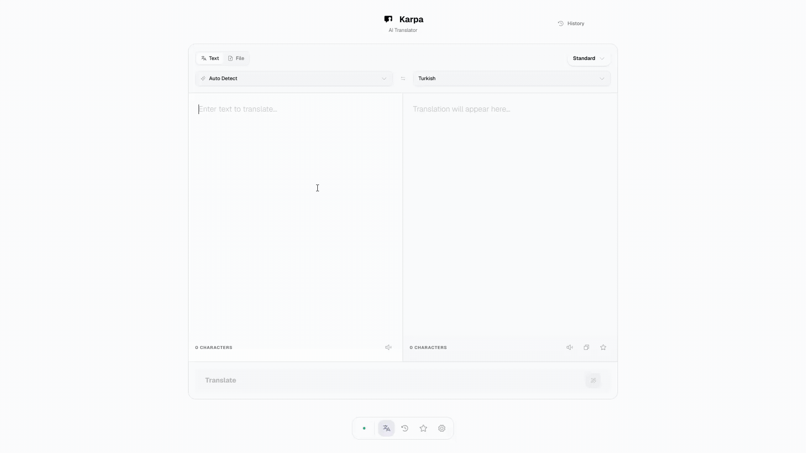

<p align="center">
  
</p>

<h1 align="center">Karpa</h1>

<p align="center">
  <strong>Privacy-first AI translation that runs entirely on your machine</strong>
</p>

<p align="center">
  <a href="https://github.com/sudoeren/karpa/releases"></a>
  
  <a href="https://github.com/sudoeren/karpa/blob/main/LICENSE"></a>
</p>

<p align="center">
  <a href="https://karpa.erencakar.com">Website</a> •
  <a href="https://karpa.erencakar.com/docs">Docs</a> •
  <a href="#download">Download</a> •
  <a href="#features">Features</a> •
  <a href="#quick-start">Quick Start</a> •
  <a href="#usage">Usage</a> •
  <a href="#build-from-source">Build from Source</a>
</p>

Karpa is a privacy-first AI translator that runs entirely on your machine.
Your data never leaves your device. No cloud, no tracking, no compromises.

<p align="center">
  
</p>

<p align="center">
  Supports LM Studio, Ollama, OpenAI, Anthropic, Google Gemini and OpenRouter.
</p>

---

## Documentation

Full documentation is available at **https://karpa.erencakar.com/docs** - guides, provider setup (LM Studio, Ollama, OpenAI, Anthropic, Gemini, OpenRouter), and troubleshooting.

---

## Features

| Feature | Description |
|---|---|
| **Complete Privacy** | All translations happen locally. No data is ever sent to external servers. |
| **Desktop App** | Native Windows app built with Tauri. No browser needed. |
| **Multi-Language Support** | Translate between 12+ languages including English, Turkish, Spanish, French, German, Italian, Portuguese, Russian, Japanese, Chinese, Korean, and Arabic. |
| **Text & File Translation** | Translate plain text or upload files (`.txt`, `.md`, `.json`, `.csv`, `.srt`, and more). |
| **Translation Tones** | Choose from Standard, Formal, Casual, or Technical tones to match your context. |
| **History & Favorites** | Automatically save your translation history and star your favorite translations. |
| **Beautiful UI** | Modern, responsive design with dark mode support and smooth animations. |
| **Text-to-Speech** | Listen to translations with built-in TTS support for multiple languages. |

---

## Quick Start

### Prerequisites

Pick one of the supported providers:
- **[LM Studio](https://lmstudio.ai/)**: Download, load a model, and start the local server
- **[Ollama](https://ollama.com/)**: Download and pull a model
- **OpenAI / Anthropic / Google Gemini / OpenRouter**: Create an account and get an API key

<a id="download"></a>
### Desktop App

**Latest version: v1.3.4** - Get Karpa for your platform from **[GitHub Releases](https://github.com/sudoeren/karpa/releases)**. Open the latest release and download the file for your OS:

| Platform | File | How to install |
|----------|------|----------------|
| **Windows** | `.exe` (NSIS) or `.msi` | Download and run the installer. Follow the setup wizard. |
| **macOS** | `.dmg` (Intel and Apple Silicon) | Open the `.dmg`, drag Karpa to Applications, then launch it. |
| **Linux** | `.deb`, `.AppImage`, `.rpm` | `.deb`/`.rpm`: install with your package manager (`sudo dpkg -i karpa_*.deb` or `sudo rpm -i karpa_*.rpm`). `AppImage`: `chmod +x Karpa_*.AppImage && ./Karpa_*.AppImage` |

Tip: You can also find all past versions and checksums on the Releases page. No account or signup required.

## Usage

### Text Translation

1. Select source language (or Auto Detect)
2. Select target language
3. Choose translation tone (optional)
4. Enter text
5. Press `Ctrl+Enter` or click **Translate**

### File Translation

1. Switch to **File** mode
2. Upload a text file
3. Select target language
4. Click **Translate**
5. Download the translated file

### Keyboard Shortcuts

| Shortcut     | Action           |
| ------------ | ---------------- |
| `Ctrl+Enter` | Translate        |

---

## Build from Source

```bash
git clone https://github.com/sudoeren/karpa.git
cd karpa
npm install
```

**Desktop app:**
```bash
npm run desktop:build      # Windows → .exe/.msi | macOS → .dmg | Linux → .deb/.AppImage
npm run desktop:dev        # Dev mode with hot reload
```

**Docker:**
```bash
docker compose up -d
# or
docker run -p 7250:7250 ghcr.io/sudoeren/karpa:latest
```

---

## Project Structure

```
karpa/
├── src/
│   ├── app/                    # Next.js App Router
│   │   ├── page.tsx            # Main translator
│   │   ├── history/            # Translation history
│   │   ├── favorites/          # Saved translations
│   │   ├── settings/           # App settings
│   │   └── about/              # About page
│   ├── components/             # React components
│   ├── contexts/               # React contexts
│   ├── hooks/                  # Custom hooks
│   └── lib/                    # Utilities & providers
│       ├── providers.ts        # LLM provider configs
│       ├── client-translate.ts # Client-side translation
│       ├── client-test-connection.ts
│       └── client-models.ts
├── public/                     # Static assets
├── src-tauri/                  # Tauri desktop app
│   ├── src/                    # Rust source
│   ├── icons/                  # App icons
│   ├── Cargo.toml
│   └── tauri.conf.json
├── Dockerfile
└── docker-compose.yml
```

---

## Uninstall

### Desktop App

- **Windows**: Settings → Apps, or re-run the installer
- **macOS**: Drag from Applications to Trash
- **Linux**: `sudo dpkg -r karpa` or remove the AppImage file

### Docker

Run the script inside the karpa folder:
```bash
./uninstall.sh          # macOS / Linux
uninstall.bat           # Windows
```

Clear browser data (history, settings, API key) manually from Settings → Data.

---

## License

MIT License. See [LICENSE](LICENSE) for details.
